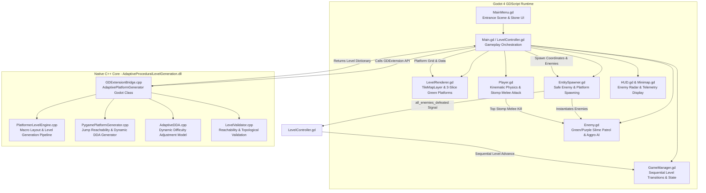

# Technical Architecture: C++ Level Engine & Godot 4 Integration

This document provides a comprehensive technical breakdown of the **Adaptive Procedural Level Generation** platformer project, detailing the architecture, algorithms, data flow, gameplay mechanics, and file-by-file responsibilities across both the **C++ native GDExtension core** and the **Godot 4 GDScript engine layer**.

---

## 1. System Overview & Architecture

The project pairs a high-performance native C++ procedural generation and dynamic difficulty adjustment (DDA) core with Godot 4.3+ GDScript for visuals, animations, physics, audio, and player interaction.



---

## 2. Core Algorithms: Mechanics, Rationale, Pros & Cons

The system employs four primary algorithmic architectures to deliver responsive, fair, and continuously engaging platformer levels.

### 2.1 Algorithm 1: Analytical Kinematic Jump Reachability & Ballistic Envelope Validation
* **Implementation Files**: `LevelEngine/PygamePlatformGenerator.h`, `.cpp`, and `Scripts/PygamePlatformGenerator.gd` (`jump_reach()`, `can_reach()`, `validPlatform()`).
* **Core Mechanics**:
  Rather than guessing platform placement or running expensive trial-and-error raycasts, the algorithm computes reachability analytically using the player's exact kinematic physics constants:
  $$\text{Gravity } g = 800.0\text{ px/s}^2, \quad \text{Jump Velocity } v_y = -420.0\text{ px/s}, \quad \text{Horizontal Speed } v_x = 180.0\text{ px/s}$$
  - **Upward Jumps ($\Delta y < 0$)**: The time to peak and horizontal distance covered during ascent is integrated through kinematic steps. If the apex cannot clear the vertical rise ($h_{peak} = \frac{v_y^2}{2g} < -\Delta y$), the jump is deemed impossible ($0.0$ reach).
  - **Downward Drops ($\Delta y > 0$)**: The trajectory calculates the ascent time to apex plus the accelerated free-fall duration:
    $$t_{apex} = \frac{-v_y}{g}, \quad t_{fall} = \sqrt{\frac{2(h_{peak} + \Delta y)}{g}}, \quad X_{max} = v_x \cdot (t_{apex} + t_{fall})$$
  - **Spatial Envelope Guard (`validPlatform`)**:
    Enforces rectangular bounding envelopes around each platform (`BOUND_X = 1`, `BOUND_Y_UPPER = 2`, `BOUND_Y_LOWER = 1`). A candidate ledge is rejected if it collides with, overlaps, or is too close to any existing platform's headroom or landing clearance.
* **Why This Algorithm Was Chosen**:
  Guarantees with 100% mathematical certainty that every platform generated is physically reachable by the player without requiring "leaps of faith" or creating impassable gaps.
* **Plus Points (Pros)**:
  - **100% Solvable Levels**: Zero uncrossable chasms or stranded platforms.
  - **Blazing Fast Performance**: Runs in $O(N)$ time per level (<0.2 ms for 30 platforms), requiring zero graph search, A*, or navmesh baking.
  - **Deterministic & Verifiable**: Identical seeds produce mathematically identical, playable platform arrangements.
* **Cons**:
  - **Strictly Ballistic**: Assumes standard projectile physics; does not natively account for complex mid-air modifiers (double jumps, wall jumps, air dashes) unless analytically factored into the equation.
  - **Conservative Envelopes**: Safety bounding buffers reject valid micro-jumps or tight parkour setups that skilled players might find fun.

---

### 2.2 Algorithm 2: Dynamic Difficulty Adjustment (DDA) Engine
* **Implementation Files**: `LevelEngine/AdaptiveDDA.h`, `.cpp`, `Engine/DifficultyManager.h`, `.cpp`, `Scripts/Analytics.gd`.
* **Core Mechanics**:
  The DDA system gathers real-time gameplay telemetry per level:
  - Total elapsed time vs. theoretical optimal completion time.
  - Number and categories of deaths (`deaths_fall`, `deaths_hazard`, `deaths_enemy`).
  - Jump execution accuracy ($\frac{\text{landed jumps}}{\text{attempted jumps}}$).
  - Combat accuracy & damage taken.
  - Highest kill combo achieved.
  
  The engine computes a normalized multi-factor skill rating ($S \in [0.0, 1.0]$) and classifies the gameplay into four distinct tiers:
  1. **BEGINNER**: Platform length 4–6 tiles, narrow jump gaps (1–2 tiles), low enemy quota (2 Green Slimes), 0% purple slimes, calm patrol speeds (45 px/s).
  2. **MODERATE**: Platform length 3–5 tiles, medium jump gaps (2–3 tiles), enemy quota (3 slimes), ~33% purple slimes, moderate aggro radius (170–240 px).
  3. **ADVANCED**: Platform length 2–4 tiles, wide jump gaps (3–4 tiles), enemy quota (4 slimes), 50% purple slimes, higher moving platform speeds.
  4. **EXPERT**: Platform length 2–3 tiles (tight precision ledges), maximum kinematic jump gaps (4–5 tiles), high enemy quota (5–6 slimes), ~70% aggressive Purple Slimes (chase speed 115 px/s, aggro radius 240 px).
* **Why This Algorithm Was Chosen**:
  Maintains the optimal "flow state" (Csikszentmihalyi's flow channel), preventing novice players from quitting due to frustrating difficulty walls while keeping experienced platformer players engaged with tight precision requirements.
* **Plus Points (Pros)**:
  - **Player Retention & Accessibility**: Seamlessly scales challenge to player capability without requiring manual menu configuration.
  - **Holistic Metric Tracking**: Evaluates movement competence and combat skill separately rather than relying on a simplistic death counter.
  - **Smooth Pacing**: Prevents jarring spikes in difficulty between sequential levels.
* **Cons**:
  - **Calibration Latency**: Requires 1–2 completed levels of telemetry before accurately gauging a new player's true skill ceiling.
  - **Exploitation Potential**: Skilled speedrunners can intentionally trigger fall deaths to artificially downgrade difficulty to achieve faster route splits.

---

### 2.3 Algorithm 3: Multi-Phase Sinusoidal Wave Macro-Elevation Pipeline
* **Implementation Files**: `LevelEngine/PlatformerLevelEngine.h`, `.cpp`, `Scripts/PygamePlatformGenerator.gd`.
* **Core Mechanics**:
  Instead of placing platforms randomly or along a linear incline, the generator models vertical elevation across horizontal span using superimposed sinusoidal waveforms:
  $$Y(x) = Y_{baseline} + A_1 \sin\left(\frac{2\pi x}{L_1} + \phi_1\right) + A_2 \sin\left(\frac{2\pi x}{L_2} + \phi_2\right)$$
  - High-tier skyline platforms generate along wave crests.
  - Mid-tier connection bridges populate the inflection zones.
  - Low-tier baseline recovery ledges populate the wave troughs.
  - Branch ledges with bonus gold coins fork off the primary critical path based on `branchProbability`.
* **Why This Algorithm Was Chosen**:
  Creates organic, varied, and visually attractive level silhouettes with natural peaks and valleys within the bounded 38x21 container, avoiding flat horizontal runs and artificial grid staircases.
* **Plus Points (Pros)**:
  - **Natural Multi-Tier Exploration**: Guarantees upper risk/reward routes alongside lower safe paths.
  - **Aesthetic Diversity**: Avoids repetitious linear stairs or boring flat layouts.
  - **Boundary Confinement**: Amplitudes are clamped to respect top ceiling clearance (row 1) and bottom solid floor baseline (row 19).
* **Cons**:
  - **Frequency Tuning Required**: If wave frequency is tuned too high, vertical slope exceeds the player's maximum jump rise ($h_{peak}$), requiring fallbacks to level out the slope.

---

### 2.4 Algorithm 4: Proximity State Machine & Top-Stomp Melee Combat AI
* **Implementation Files**: `Scripts/Enemy.gd`, `Scripts/EntitySpawner.gd`.
* **Core Mechanics**:
  - **Safe-Distance Platform Spawning**:
    Enemies are filtered and placed exclusively on platforms situated at least **220 pixels away** from the player spawn point. This guarantees that the player is never ambushed or damaged upon spawning.
  - **Two-State AI Machine**:
    1. *Idle / Platform Patrol*: Slime checks ground ahead using tile lookup queries (`tile_foot` for cliff edge, `tile_ahead` for wall). Reverses direction at ledges or walls without falling into the void.
    2. *Pursuit / Aggro State*: Activated when Euclidean distance $d(\text{player}, \text{enemy}) \le R_{aggro}$ ($170\text{ px}$ for Green Slime, $240\text{ px}$ for Purple Slime). Enemy faces the player and accelerates to `chase_speed`.
  - **Top-Stomp Melee Elimination Resolution**:
    When a collision occurs between player and enemy:
    - *Stomp Condition*: Player vertical velocity is downward ($v_y > -50.0\text{ px/s}$) and player feet are above the enemy ($y_{player} < y_{enemy} - 4.0\text{ px}$).
    - *Resolution*: Enemy is squashed via tween, audio plays, player receives an upward bounce impulse ($v_y = -350.0\text{ px/s}$), and the remaining enemy counter decrements.
    - *Side Contact*: If the player touches the enemy from the side or bottom without jumping on top, the player takes damage and knockback.
  - **Level Advance Trigger**:
    Defeating the last enemy in the level emits `all_enemies_defeated`, which advances to the next level.
* **Why This Algorithm Was Chosen**:
  Replaces the passive "reach the door" trope with active, satisfying melee combat. Jumping on enemies is universally intuitive in platformers (Super Mario, Sonic, Hollow Knight pogo jumps) and directly engages the player with the platform generation geometry.
* **Plus Points (Pros)**:
  - **Immediate Fair Play**: Minimum 220px distance prevents cheap hits on level start.
  - **Rewarding Movement Skill**: Bouncing off enemy heads allows skilled players to chain jumps to reach elevated platforms.
  - **Clear Progression Goal**: Eliminating all slimes gives every level a clear, unambiguous objective.
* **Cons**:
  - **Precision Requirement**: Players who misjudge their jump timing by a few pixels take side contact damage instead of landing a stomp.
  - **Edge-Case Tunneling**: At low framerates, high-velocity player falls could theoretically tunnel past the 4px vertical delta check (mitigated in Godot by continuous CharacterBody2D `move_and_slide()` physics ticks).

---

## 3. Sequential Level Advancement Architecture

### Root Cause of the Previous Level Skipping (e.g., Level 1 $\to$ Level 5/6 $\to$ Level 8/10)
In previous revisions:
1. `_check_exit_overlap()` ran every frame in `LevelController.gd`'s `process_frame()`.
2. When the exit trigger fired, `GameManager.gd` incremented `level_number += 1` and immediately called `reset_for_new_level()`, which reset `_is_transitioning = false` within the same frame.
3. Because the player node remained overlapping the exit collision shape for 4–5 consecutive physics frames before the next level geometry loaded, `on_level_complete()` re-triggered on every single frame, causing `level_number` to jump from 1 to 5 or 6, and on the next level from 6 to 10.

### The Solution: Multi-Layer Transition Debounce
Sequential progression (`1 -> 2 -> 3 -> 4...`) is now guaranteed by three independent architectural gates:
1. **LevelController Completion Latch (`_level_complete_triggered`)**:
   `LevelController.gd` maintains a boolean flag initialized to `false` on every level generation. When `_on_all_enemies_defeated()` fires, the latch is set to `true`. All subsequent signals or calls within that level lifecycle are strictly ignored.
2. **Player Completion Latch (`_completed`)**:
   `Player.gd` maintains `_completed: bool = false`, ensuring `emit_signal("level_complete")` can execute only once per level session.
3. **GameManager Transition Lock (`_is_transitioning`) & Black Screen Fade Tween**:
   When `GameManager.on_level_complete()` executes:
   - Sets `_is_transitioning = true`.
   - Increments `level_number += 1` exactly once.
   - Tweens full-screen fade rect to black ($0.22\text{ s}$).
   - Emits `request_next_level` to generate the new level.
   - Tweens fade rect back to transparent ($0.22\text{ s}$).
   - Only resets `_is_transitioning = false` **after** the screen has completely faded back in and gameplay has resumed.

---

## 4. File-by-File Reference Map

| File Path | Language | Core Responsibility |
| :--- | :--- | :--- |
| `LevelEngine/PygamePlatformGenerator.h/.cpp` | C++ | Analytical jump reachability algorithm, platform validity envelopes, dynamic gap/length scaling. |
| `LevelEngine/PlatformerLevelEngine.h/.cpp` | C++ | Macro pipeline: sinusoidal wave elevation, floating ledge placement, perimeter container walls, coin distribution. |
| `LevelEngine/AdaptiveDDA.h/.cpp` | C++ | Dynamic Difficulty Adjustment model tracking performance telemetry and calculating skill scores. |
| `LevelEngine/LevelValidator.h/.cpp` | C++ | Topological reachability and playability verification. |
| `Engine/EngineBridge.cpp` | C++ | Godot GDExtension bindings exposing native engine methods to GDScript. |
| `godot_project/.../Scripts/MainMenu.gd` | GDScript | Main menu: stone-textured UI, animated Knight, spinning Coin, Green Slime preview, 4 difficulty modes. |
| `godot_project/.../Scripts/LevelRenderer.gd` | GDScript | Manages `TileMapLayer`, slices green platforms (`platforms_32.png` left/center/right caps), sets physics collisions. |
| `godot_project/.../Scripts/EntitySpawner.gd` | GDScript | Spawns enemies $\ge 220\text{ px}$ from player spawn, enforces 4-tier quotas/types, emits `all_enemies_defeated`. |
| `godot_project/.../Scripts/Enemy.gd` | GDScript | Green and Purple Slime AI, patrol/cliff sensing, proximity aggro chase, and top-stomp melee kill mechanics. |
| `godot_project/.../Scripts/Player.gd` | GDScript | 2D kinematic player controller, jump buffering, coyote time, health, and top-stomp melee interaction. |
| `godot_project/.../Scripts/LevelController.gd` | GDScript | Manages level lifecycle, connects enemy elimination signals, debounces level transitions. |
| `godot_project/.../Scripts/GameManager.gd` | GDScript | Session lives, pause menu, sequential `level_number` tracking, and fade transition locks. |
| `godot_project/.../Scripts/HUD.gd` | GDScript | Displays `LEVEL X`, `OBJECTIVE: DEFEAT ENEMIES (N)`, lives hearts, and `[ BEGINNER/MODERATE/ADVANCED/EXPERT ]`. |
| `godot_project/.../Scripts/Minimap.gd` | GDScript | Real-time radar rendering level layout, live player blip, and pulsing red enemy radar blips. |
| `godot_project/.../Scripts/BackgroundParallax.gd` | GDScript | Artifact-free smooth gradient sky, soft clouds, and parallax mountain silhouettes. |

---

## 5. Verification & Testing

### Running the Native C++ Test Suite
```bash
# Run all 13 automated tests (100% pass rate)
ctest --test-dir build -C Release --output-on-failure
```

### Running the Godot Project
1. Open Godot Engine 4.3+.
2. Launch `godot_project/adaptiveproceduralplatformer/project.godot`.
3. Press **F5** to start in the Main Menu.
4. Select desired difficulty (`BEGINNER`, `MODERATE`, `ADVANCED`, `EXPERT`) and press **PLAY**.
5. Hunt down and jump on all slimes to sequentially advance from Level 1 $\to$ Level 2 $\to$ Level 3 $\to$ Level 4.
