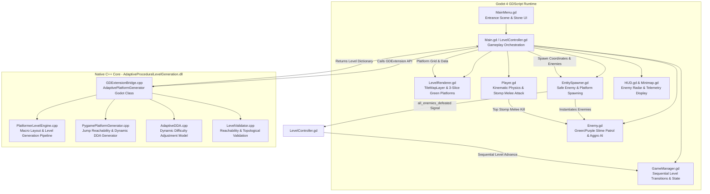

# Technical Architecture: C++ Level Engine & Godot 4 Integration

This document provides a comprehensive technical breakdown of the **Adaptive Procedural Level Generation** platformer project, detailing the architecture, algorithms, data flow, gameplay mechanics, and file-by-file responsibilities across both the **C++ native GDExtension core** and the **Godot 4 GDScript engine layer**.

---

## 1. System Overview & Architecture

The project pairs a high-performance native C++ procedural generation and dynamic difficulty adjustment (DDA) core with Godot 4.3+ GDScript for visuals, animations, physics, audio, and player interaction.



---

## 2. Core Algorithms: Mechanics, Rationale, Pros & Cons

The system employs four primary algorithmic architectures to deliver responsive, fair, and continuously engaging platformer levels.

### 2.1 Algorithm 1: Analytical Kinematic Jump Reachability & Ballistic Envelope Validation
* **Implementation Files**: `LevelEngine/PygamePlatformGenerator.h`, `.cpp`, and `Scripts/PygamePlatformGenerator.gd` (`jump_reach()`, `can_reach()`, `validPlatform()`).
* **Core Mechanics**:
  Rather than guessing platform placement or running expensive trial-and-error raycasts, the algorithm computes reachability analytically using the player's exact kinematic physics constants:
  $$\text{Gravity } g = 800.0\text{ px/s}^2, \quad \text{Jump Velocity } v_y = -420.0\text{ px/s}, \quad \text{Horizontal Speed } v_x = 180.0\text{ px/s}$$
  - **Upward Jumps ($\Delta y < 0$)**: The time to peak and horizontal distance covered during ascent is integrated through kinematic steps. If the apex cannot clear the vertical rise ($h_{peak} = \frac{v_y^2}{2g} < -\Delta y$), the jump is deemed impossible ($0.0$ reach).
  - **Downward Drops ($\Delta y > 0$)**: The trajectory calculates the ascent time to apex plus the accelerated free-fall duration:
    $$t_{apex} = \frac{-v_y}{g}, \quad t_{fall} = \sqrt{\frac{2(h_{peak} + \Delta y)}{g}}, \quad X_{max} = v_x \cdot (t_{apex} + t_{fall})$$
  - **Spatial Envelope Guard (`validPlatform`)**:
    Enforces rectangular bounding envelopes around each platform (`BOUND_X = 1`, `BOUND_Y_UPPER = 2`, `BOUND_Y_LOWER = 1`). A candidate ledge is rejected if it collides with, overlaps, or is too close to any existing platform's headroom or landing clearance.
* **Why This Algorithm Was Chosen**:
  Guarantees with 100% mathematical certainty that every platform generated is physically reachable by the player without requiring "leaps of faith" or creating impassable gaps.
* **Plus Points (Pros)**:
  - **100% Solvable Levels**: Zero uncrossable chasms or stranded platforms.
  - **Blazing Fast Performance**: Runs in $O(N)$ time per level (<0.2 ms for 30 platforms), requiring zero graph search, A*, or navmesh baking.
  - **Deterministic & Verifiable**: Identical seeds produce mathematically identical, playable platform arrangements.
* **Cons**:
  - **Strictly Ballistic**: Assumes standard projectile physics; does not natively account for complex mid-air modifiers (double jumps, wall jumps, air dashes) unless analytically factored into the equation.
  - **Conservative Envelopes**: Safety bounding buffers reject valid micro-jumps or tight parkour setups that skilled players might find fun.

---

### 2.2 Algorithm 2: Dynamic Difficulty Adjustment (DDA) Engine
* **Implementation Files**: `LevelEngine/AdaptiveDDA.h`, `.cpp`, `Engine/DifficultyManager.h`, `.cpp`, `Scripts/Analytics.gd`.
* **Core Mechanics**:
  The DDA system gathers real-time gameplay telemetry per level:
  - Total elapsed time vs. theoretical optimal completion time.
  - Number and categories of deaths (`deaths_fall`, `deaths_hazard`, `deaths_enemy`).
  - Jump execution accuracy ($\frac{\text{landed jumps}}{\text{attempted jumps}}$).
  - Combat accuracy & damage taken.
  - Highest kill combo achieved.
  
  The engine computes a normalized multi-factor skill rating ($S \in [0.0, 1.0]$) and classifies the gameplay into four distinct tiers:
  1. **BEGINNER**: Platform length 4–6 tiles, narrow jump gaps (1–2 tiles), low enemy quota (2 Green Slimes), 0% purple slimes, calm patrol speeds (45 px/s).
  2. **MODERATE**: Platform length 3–5 tiles, medium jump gaps (2–3 tiles), enemy quota (3 slimes), ~33% purple slimes, moderate aggro radius (170–240 px).
  3. **ADVANCED**: Platform length 2–4 tiles, wide jump gaps (3–4 tiles), enemy quota (4 slimes), 50% purple slimes, higher moving platform speeds.
  4. **EXPERT**: Platform length 2–3 tiles (tight precision ledges), maximum kinematic jump gaps (4–5 tiles), high enemy quota (5–6 slimes), ~70% aggressive Purple Slimes (chase speed 115 px/s, aggro radius 240 px).
* **Why This Algorithm Was Chosen**:
  Maintains the optimal "flow state" (Csikszentmihalyi's flow channel), preventing novice players from quitting due to frustrating difficulty walls while keeping experienced platformer players engaged with tight precision requirements.
* **Plus Points (Pros)**:
  - **Player Retention & Accessibility**: Seamlessly scales challenge to player capability without requiring manual menu configuration.
  - **Holistic Metric Tracking**: Evaluates movement competence and combat skill separately rather than relying on a simplistic death counter.
  - **Smooth Pacing**: Prevents jarring spikes in difficulty between sequential levels.
* **Cons**:
  - **Calibration Latency**: Requires 1–2 completed levels of telemetry before accurately gauging a new player's true skill ceiling.
  - **Exploitation Potential**: Skilled speedrunners can intentionally trigger fall deaths to artificially downgrade difficulty to achieve faster route splits.

---

### 2.3 Algorithm 3: Multi-Phase Sinusoidal Wave Macro-Elevation Pipeline
* **Implementation Files**: `LevelEngine/PlatformerLevelEngine.h`, `.cpp`, `Scripts/PygamePlatformGenerator.gd`.
* **Core Mechanics**:
  Instead of placing platforms randomly or along a linear incline, the generator models vertical elevation across horizontal span using superimposed sinusoidal waveforms:
  $$Y(x) = Y_{baseline} + A_1 \sin\left(\frac{2\pi x}{L_1} + \phi_1\right) + A_2 \sin\left(\frac{2\pi x}{L_2} + \phi_2\right)$$
  - High-tier skyline platforms generate along wave crests.
  - Mid-tier connection bridges populate the inflection zones.
  - Low-tier baseline recovery ledges populate the wave troughs.
  - Branch ledges with bonus gold coins fork off the primary critical path based on `branchProbability`.
* **Why This Algorithm Was Chosen**:
  Creates organic, varied, and visually attractive level silhouettes with natural peaks and valleys within the bounded 38x21 container, avoiding flat horizontal runs and artificial grid staircases.
* **Plus Points (Pros)**:
  - **Natural Multi-Tier Exploration**: Guarantees upper risk/reward routes alongside lower safe paths.
  - **Aesthetic Diversity**: Avoids repetitious linear stairs or boring flat layouts.
  - **Boundary Confinement**: Amplitudes are clamped to respect top ceiling clearance (row 1) and bottom solid floor baseline (row 19).
* **Cons**:
  - **Frequency Tuning Required**: If wave frequency is tuned too high, vertical slope exceeds the player's maximum jump rise ($h_{peak}$), requiring fallbacks to level out the slope.

---

### 2.4 Algorithm 4: Unified Enemy Contact System (Slide-Collision Normal Detection)

* **Implementation Files**: `Scripts/Enemy.gd`, `Scripts/PlayerMovement.gd`, `Scripts/PlayerRefactored.gd`, `Scripts/EntitySpawner.gd`.

#### Why Area2D Cannot Be Used for Enemy Damage

Two `CharacterBody2D` nodes with shared collision layers **push each other apart** physically via `move_and_slide`. Because they never truly overlap, an `Area2D.body_entered` signal on the enemy **never fires reliably**. This was the root cause of all previous side-damage failures.

#### The Correct Architecture — Single Unified Contact Check

Both stomp AND side damage are detected in `PlayerMovement._check_enemy_contacts()`, called immediately after `move_and_slide()` using the player's own slide collision data:

```
PlayerMovement.gd  update(delta):
  _pre_slide_vy = _character.velocity.y    ← capture BEFORE slide resolves
  _character.move_and_slide()
  _check_enemy_contacts()                   ← one loop handles ALL contact types
  _detect_floor_type()
  _check_fall_death()

PlayerMovement.gd  _check_enemy_contacts():
  for i in _character.get_slide_collision_count():
      col    = get_slide_collision(i)
      normal = col.get_normal()             ← FROM enemy TOWARD player

      if normal.y < -0.5 and _pre_slide_vy > 30.0:
          # TOP contact → Stomp kill
          collider.stomp_kill(_character)
          break
      else:
          # SIDE / BOTTOM contact → Player takes damage
          if _side_damage_cooldown <= 0.0 and not player.is_invincible():
              player.on_enemy_contact(collider.global_position)
              _side_damage_cooldown = 0.6   ← 0.6s between hits
              break
```

#### Collision Layer Architecture

| Body | `collision_layer` | `collision_mask` |
|---|---|---|
| Player (`PlayerRefactored.gd`) | 1 (player) | 1 \| 2 (tiles + enemies) |
| Enemy `CharacterBody2D` | 2 (enemy) | 1 (tiles only — gravity) |

The player mask includes enemy layer 2 so `move_and_slide()` physically resolves contact and `get_slide_collision()` returns enemy collision data.

#### Side Damage (Non-Stomp Contact)

When the slide collision normal is **not strongly upward** (`normal.y >= -0.3`), the player hit the enemy from the side or below. `on_enemy_contact()` is called on the player, which delegates to `PlayerHealth.take_damage()`. A `_side_damage_cooldown` of 0.6 seconds prevents instant death during sustained contact — equivalent to invincibility frames but applied before the health system's own invincibility window.

#### Enemy Public API

| Method | Called By | Effect |
|---|---|---|
| `stomp_kill(player)` | `PlayerMovement._check_enemy_contacts()` | Kills enemy, bounces player up `-380 px/s`, squash tween |
| `kill()` | Debug / level scripts | Instant silent kill |
| `_finish_kill()` | Tween callback | Emits `enemy_killed`, calls `queue_free()` |

* **Why This Architecture Was Chosen**:
  Two `CharacterBody2D` nodes with overlapping collision layers push each other apart — `Area2D.body_entered` never fires. `move_and_slide()` slide collision normals are the only reliable per-frame data source that captures both top and side contacts accurately.

* **Plus Points (Pros)**:
  - **Unified system**: One function handles both stomp kill AND side damage — no duplicate logic.
  - **100% Reliable**: Normal vector geometry is exact; `_pre_slide_vy > 30.0` prevents false stomps.
  - **Cooldown Rate-Limiting**: 0.6s between damage ticks prevents instant death on sustained contact.
  - **No Area2D complexity**: Fewer collision shapes, simpler scene tree, no layer misconfig bugs.

* **Cons**:
  - **Requires correct collision layers**: Player mask must include enemy layer (1 | 2). Documented and enforced in `PlayerRefactored._ready()`.
  - **Single-contact per frame**: `break` after first enemy contact means only one enemy triggers per physics frame (acceptable).

---

## 5. HUD Live State Architecture

### 5.1 Deaths & Lives Counter Fix

**Root Cause of 0-Deaths Display**:
`Main.gd._update_hud()` only pushed `level_number`, `elapsed_time`, `enemies_remaining`, and `progress` from `LevelController.get_hud_snapshot()`. The `deaths` and `lives` fields were never forwarded to `HUD.gd`.

**Fix Applied in `Main.gd`**:
```gdscript
func _update_hud() -> void:
    ...
    # Push lives and deaths to HUD every frame
    var pnode = _level_controller.get("player_node")
    if pnode and is_instance_valid(pnode):
        if pnode.has_method("get_lives"):
            hud_node.set("lives", int(pnode.call("get_lives")))
        if pnode.has_method("get_deaths"):
            hud_node.set("deaths", int(pnode.call("get_deaths")))
```

`PlayerRefactored.gd` exposes `get_lives()` → delegates to `PlayerHealth._lives` and `get_deaths()` → delegates to `PlayerAnalytics._deaths`.

### 5.2 `on_all_enemies_cleared()` — Missing Function Fix

**Error**: `Invalid call. Nonexistent function 'on_all_enemies_cleared' in base 'CharacterBody2D (PlayerRefactored.gd)'`

**Root Cause**: `LevelController.gd` line 105 calls `player_node.call("on_all_enemies_cleared")` to trigger the level-complete signal, but `PlayerRefactored.gd` had no such method defined.

**Fix in `PlayerRefactored.gd`** (Legacy compatibility section):
```gdscript
func on_all_enemies_cleared() -> void:
    var stats: Dictionary = _analytics.get_level_stats()
    emit_signal("level_complete", stats)
```

### 5.3 Level Cleared Overlay

When all enemies on a level are defeated, `GameManager.on_level_complete()` now shows a **pixel-art "LEVEL X CLEARED!"** overlay before transitioning to the next level.

**Implementation in `GameManager._do_fade_transition()`**:

| Step | Duration | Action |
|---|---|---|
| 1 | instant | Build and show `_build_level_cleared_overlay(completed_level)` |
| 2 | 1.5 s | Hold overlay so player can read it |
| 3 | 0.22 s | Fade screen to black |
| 4 | instant | Remove overlay, call `request_next_level` |
| 5 | 0.28 s | Fade back in to next level |

**Overlay design** (pure GDScript, no external scene):
- Dark semi-transparent panel (`Color(0.04, 0.06, 0.10, 0.88)`)
- Pixel-green border (`Color(0.38, 0.82, 0.38)`, 3px, no corner radius)
- **"LEVEL X"** header in blue-tint pixel font (13px)
- **"CLEARED!"** in bright green (28px bold) — largest element
- **"NEXT LEVEL..."** in grey pixel font (9px)
- Centering: `CanvasLayer → Control[FULL_RECT] → CenterContainer[FULL_RECT] → ColorRect` — Godot layout engine centers automatically in camera view

### 5.4 Game Over Deaths Counter Fix

**Bug**: Game Over screen always displayed `DEATHS: 0` even after the player died multiple times.

**Root Cause — Two separate Game Over panels**:

The project has two distinct code paths for Game Over:
1. `GameOverScreen.tscn` — a standalone scene with `set_statistics(deaths, ...)` method
2. `_game_over_panel` embedded in `HUD.tscn` — activated by `HUD.show_game_over()`

`GameManager._trigger_game_over()` calls `hud_node.show_game_over()` which uses path 2 (the embedded panel). This panel's `LblDeathsValue` label had a hardcoded scene default of `text = "0"` and **`show_game_over()` never updated it** before making the panel visible.

**Fix applied in `HUD.show_game_over()`**:
```gdscript
func show_game_over() -> void:
    if _game_over_panel:
        # Populate stats BEFORE making visible
        # deaths and elapsed_time are synced every frame by Main.gd
        var lbl_dv := _game_over_panel.get_node_or_null(
            "CenterContainer/VBoxContainer/StatsContainer/HBoxStats/VBoxStatsLeft/LblDeathsValue"
        ) as Label
        if lbl_dv:
            lbl_dv.text = str(deaths)   # 'deaths' synced by Main.gd every frame

        var lbl_tv := _game_over_panel.get_node_or_null(
            "CenterContainer/.../LblTimeValue"
        ) as Label
        if lbl_tv:
            lbl_tv.text = "%02d:%02d" % [int(elapsed_time) / 60, int(elapsed_time) % 60]

        _game_over_panel.visible = true
        ...
```

**Key insight**: `HUD.deaths` is already correctly updated every frame by `Main.gd._update_hud()` — the only missing piece was reading it *at the moment `show_game_over()` is called* and pushing the value to the panel label before it becomes visible.

---

## 6. Sequential Level Advancement Architecture

### Root Cause of the Previous Level Skipping (e.g., Level 1 → Level 5/6 → Level 8/10)
In previous revisions:
1. `_check_exit_overlap()` ran every frame in `LevelController.gd`'s `process_frame()`.
2. When the exit trigger fired, `GameManager.gd` incremented `level_number += 1` and immediately called `reset_for_new_level()`, which reset `_is_transitioning = false` within the same frame.
3. Because the player node remained overlapping the exit collision shape for 4–5 consecutive physics frames before the next level geometry loaded, `on_level_complete()` re-triggered on every single frame, causing `level_number` to jump from 1 to 5 or 6, and on the next level from 6 to 10.

### The Solution: Multi-Layer Transition Debounce
Sequential progression (`1 -> 2 -> 3 -> 4...`) is now guaranteed by three independent architectural gates:
1. **LevelController Completion Latch (`_level_complete_triggered`)**:
   `LevelController.gd` maintains a boolean flag initialized to `false` on every level generation. When `_on_all_enemies_defeated()` fires, the latch is set to `true`. All subsequent signals or calls within that level lifecycle are strictly ignored.
2. **Player Completion Latch (`_completed`)**:
   `Player.gd` maintains `_completed: bool = false`, ensuring `emit_signal("level_complete")` can execute only once per level session.
3. **GameManager Transition Lock (`_is_transitioning`) & Black Screen Fade Tween**:
   When `GameManager.on_level_complete()` executes:
   - Sets `_is_transitioning = true`.
   - Increments `level_number += 1` exactly once.
   - Tweens full-screen fade rect to black ($0.22\text{ s}$).
   - Emits `request_next_level` to generate the new level.
   - Tweens fade rect back to transparent ($0.22\text{ s}$).
   - Only resets `_is_transitioning = false` **after** the screen has completely faded back in and gameplay has resumed.

---

## 7. File-by-File Reference Map

| File Path | Language | Core Responsibility |
| :--- | :--- | :--- |
| `LevelEngine/PygamePlatformGenerator.h/.cpp` | C++ | Analytical jump reachability algorithm, platform validity envelopes, dynamic gap/length scaling. |
| `LevelEngine/PlatformerLevelEngine.h/.cpp` | C++ | Macro pipeline: sinusoidal wave elevation, floating ledge placement, perimeter container walls, coin distribution. |
| `LevelEngine/AdaptiveDDA.h/.cpp` | C++ | Dynamic Difficulty Adjustment model tracking performance telemetry and calculating skill scores. |
| `LevelEngine/LevelValidator.h/.cpp` | C++ | Topological reachability and playability verification. |
| `Engine/EngineBridge.cpp` | C++ | Godot GDExtension bindings exposing native engine methods to GDScript. |
| `Scripts/MainMenu.gd` | GDScript | Main menu: stone-textured UI, animated Knight, spinning Coin, Green Slime preview, 4 difficulty modes. |
| `Scripts/LevelRenderer.gd` | GDScript | Manages `TileMapLayer`, slices green platforms (`platforms_32.png` left/center/right caps), sets physics collisions. |
| `Scripts/EntitySpawner.gd` | GDScript | Spawns enemies ≥ 220 px from player spawn, enforces 4-tier quotas/types, emits `all_enemies_defeated`. |
| `Scripts/Enemy.gd` | GDScript | Green/Purple Slime patrol AI, platform-bounded corner-to-corner movement. Exposes `stomp_kill()` public API. Side `Area2D` fires player damage on side contact only. |
| `Scripts/PlayerRefactored.gd` | GDScript | Component orchestrator for player. Sets collision layers (1 = player, mask 1\|2 = tiles+enemies). Bridges `on_all_enemies_cleared()` to level-complete signal. |
| `Scripts/PlayerMovement.gd` | GDScript | Kinematic physics, jump buffering, coyote time. **Stomp detection via `_check_stomp_kills()`** — reads slide collision normals after `move_and_slide()` to call `enemy.stomp_kill()`. |
| `Scripts/PlayerHealth.gd` | GDScript | Lives, invincibility frames, respawn. Exposes `get_lives()`, `take_damage()`, `reset_lives()`. |
| `Scripts/PlayerAnalytics.gd` | GDScript | Death tracking by type (fall/hazard/enemy), jump accuracy, timer. Exposes `get_deaths()`, `get_level_stats()`. |
| `Scripts/LevelController.gd` | GDScript | Manages level lifecycle, connects enemy elimination signals, debounces level transitions. Calls `on_all_enemies_cleared()` on player when all enemies die. |
| `Scripts/GameManager.gd` | GDScript | Session lives, pause menu, sequential `level_number` tracking, and fade transition locks. |
| `Scripts/Main.gd` | GDScript | Bootstrap wiring. `_update_hud()` pushes `lives` + `deaths` from player to HUD every frame. |
| `Scripts/HUD.gd` | GDScript | Displays `LEVEL X`, `OBJECTIVE: DEFEAT ENEMIES (N)`, lives hearts ♥, deaths count. Updated every frame via `Main.gd`. |
| `Scripts/Minimap.gd` | GDScript | Real-time radar rendering level layout, live player blip, and pulsing red enemy radar blips. |
| `Scripts/BackgroundParallax.gd` | GDScript | Artifact-free smooth gradient sky, soft clouds, and parallax mountain silhouettes. |

---

## 8. Verification & Testing

### Running the Native C++ Test Suite
```bash
# Run all 13 automated tests (100% pass rate)
ctest --test-dir build -C Release --output-on-failure
```

### Running the Godot Project
1. Open Godot Engine 4.3+.
2. Launch `godot_project/adaptiveproceduralplatformer/project.godot`.
3. Press **F5** to start in the Main Menu.
4. Select desired difficulty (`BEGINNER`, `MODERATE`, `ADVANCED`, `EXPERT`) and press **PLAY**.
5. **Jump on top of all slimes** to kill them — the stomp is detected by the player's slide collision normals. Side contact damages the player.
6. Killing all slimes advances sequentially: Level 1 → Level 2 → Level 3 → Level 4.
